# Architecture Documentation

## 🏗️ System Overview

**AI Changelog Insights** is an autonomous content generation system that aggregates daily updates from top AI repositories (GitHub) and summarizes them using Gemini LLMs into a static dashboard.

### High-Level Flow

```mermaid
graph LR
    A[Scheduler] -->|Trigger| B(src/main.py)
    B -->|Fetch Repos| C[GitHub API]
    C -->|Changelogs & Releases| B
    B -->|Summarize| D[Gemini API]
    D -->|Structured JSON| B
    B -->|Render| E[Jinja2 + Markdown → HTML]
    E -->|Output| F[Static Site + RSS]
    F -->|Deploy| G[GitHub Pages]
```



---

## 📂 Project Structure

```
ai-changelog-insights/
├── .github/workflows/   # CI/CD pipeline (daily-update.yml)
├── scripts/             # Automation scripts (PowerShell)
├── site/                # Generated static website (HTML/CSS/RSS)
├── src/                 # Core application logic (Python)
│   ├── config.py        # API keys, model settings, prompts
│   ├── github_client.py # GitHub fetcher with VIP + search
│   ├── summarizer.py    # Gemini LLM integration with fallback
│   └── main.py          # Orchestrator & site generator
├── tests/               # Automated flow tests
├── logs/                # Runtime logs
├── .env                 # Secrets (API Keys) - NOT COMMITTED
├── pyproject.toml       # Dependency management (uv)
└── README.md            # User guide
```

---

## 🧩 Core Components & Libraries

### 1. **Package Management: `uv`**
-   **Why**: Extremely fast Python package installer and resolver.
-   **Key Command**: `uv run python -m src.main` (executes in isolated env).

### 2. **Repository Fetcher: `src/github_client.py`**
-   **Library**: `PyGithub`, `tenacity`
-   **Role**: Fetches changelogs/releases from VIP repositories first, then searches for active AI repos by stars.
-   **Retry Logic**: Exponential backoff (5 attempts) for rate limits and connection errors.
-   **Data Sources**: `CHANGELOG.md` (and variants) → direct file read; or GitHub Releases API → pseudo-changelog.

### 3. **LLM Summarizer: `src/summarizer.py`**
-   **Library**: `google-genai` (Gemini SDK)
-   **Role**: Sends changelog text + structured prompt → Gemini → Returns JSON with What's New, Why Important, Try It Out (3 levels).
-   **Model Strategy**: Primary (`gemini-3-flash-preview`) → Fallback (`gemini-2.5-flash` → `gemini-2.0-flash`).
-   **Resilience**:
    -   Retries on 503 (Service Unavailable), 429 (Rate Limit), and 504 (Deadline Exceeded).
    -   Respects server-suggested `retryDelay` from error responses.
    -   Truncated JSON repair — closes open strings/arrays/objects when response is cut off mid-generation.
-   **Rate Limiting**: 12s sleep between calls (5 RPM free tier). Configurable via `RATE_LIMIT_DELAY`.
-   **Customization**: Edit prompts in `src/config.py` (`CHANGELOG_UPDATE_CHECK_PROMPT`, `GLOBAL_SUMMARY_PROMPT`).

### 4. **Site Generator: `src/main.py`**
-   **Libraries**: `jinja2`, `markdown`, `pathlib`
-   **Role**:
    1.  Orchestrates fetching and summarization.
    2.  Converts structured JSON → HTML cards.
    3.  Renders `site/template.html` with Jinja2.
    4.  Generates RSS feed using an external template (`site/rss_template.xml`).
-   **Output**: `site/index.html`, `site/archives/{date}.html`, `site/feed.xml`, `site/meta.json`.

---

## 🔄 Data Flow Detail

1.  **Trigger**: GitHub Actions cron (23:55 UTC) or manual `uv run python -m src.main --date YYYY-MM-DD`.
2.  **Fetch**: `github_client.py` yields VIP repos, then searches for active AI repos.
    -   *Input*: VIP list + GitHub search query (stars>500, pushed recently)
    -   *Output*: `{ name, full_name, changelog, stars, ... }`
3.  **Local Pre-check**: If `target_date` string not found in changelog text, skip LLM call entirely (cost saving).
4.  **LLM Summarize**: `summarizer.py` calls Gemini with truncated changelog excerpt.
    -   *Input*: Changelog text around the target date + structured prompt
    -   *Output*: JSON `{ update_found, title, whats_new[], why_important, try_it_out{} }`
5.  **Render**: `main.py` converts JSON to HTML, applies Jinja2 template, writes static files.
6.  **Deploy**: GitHub Actions pushes `site/` to `gh-pages` branch.

---

## 🛠️ Making Quick Changes

### "I want to change the LLM output style"
-   **File**: `src/config.py`
-   **Action**: Edit `CHANGELOG_UPDATE_CHECK_PROMPT` or `GLOBAL_SUMMARY_PROMPT`.

### "I want to change the website look"
-   **File**: `site/style.css`
-   **Action**: Edit CSS variables (`--primary-color`, etc).

### "I want to change the layout structure"
-   **File**: `site/template.html`
-   **Action**: Edit HTML. Use `{{ content | safe }}` for rendered HTML.

### "I want to add/remove VIP repos"
-   **File**: `src/config.py`
-   **Action**: Edit `VIP_REPOS` list.

---

## ⚠️ Key Constraints
-   **API Limits**: GitHub rate limits handled by `GH_ACCESS_TOKEN`. Gemini free tier: 5 RPM, ~20 RPD (throttled by `RATE_LIMIT_DELAY` and `DAILY_LIMIT`).
-   **JSON Parsing**: LLM must return valid JSON. System includes regex extraction, truncated-JSON repair, and old-format fallbacks.
-   **Token Budget**: `MAX_OUTPUT_TOKENS=16000` to prevent truncation on complex 3-level Try It Out responses.
